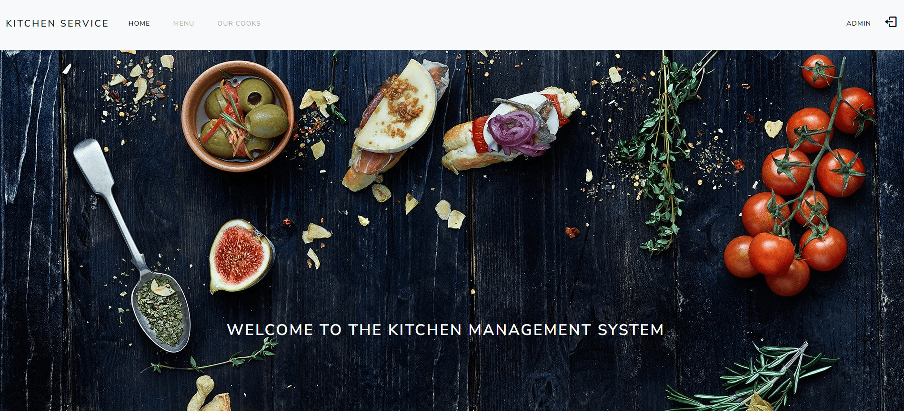

# kitchen-management-system


Django project for managing restaurant kitchen

## Check it out!

[Kitchen management project deployed to Render](https://kitchen-management-system.onrender.com/)

If you don't want to register you can log in with this credentials:
* Login: admin
* Password: Test854697!

## Installation

```shell
git clone https://github.com/VladKyianytsia/kitchen-management-system
cd kitchen-management-system
python3 -m venv venv
source venv/bin/activate
pip install -r requirements.txt
python manage.py runserver # starts Django Server
```

## Features

* Authentication and registration functionality for Cook/User
* Managing dish types & dishes directly from website interface
* Admin panel for advanced managing

## Demo

